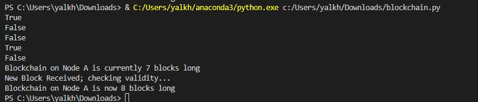
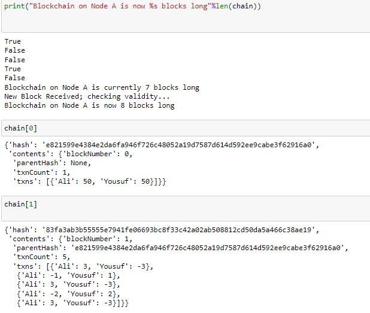

# Mini Financial Blockchain System

## Description
A simple Python-based blockchain system for secure financial transactions. It validates transactions to prevent overdrafts, maintains a ledger state, and ensures data integrity using block hashes and genesis block creation.

## How to Run
1. Ensure you have Python installed.
2. Save the code as `blockchain.py`.
3. Open a terminal, navigate to the project directory, and run:
   ```bash
   python blockchain.py
   ```

## Output
Example outputs from running the program:




## Tutorial: Customizing and Using the Blockchain

### Basic Usage
- The program initializes a simple blockchain, creates transactions, and validates them as new blocks are added.

### Personalizing the Blockchain
1. **Changing Participants and Initial Balances**:
   - By default, the initial state is defined as:
     ```python
     state = {u'Ali': 50, u'Yousuf': 50}
     ```
   - To change participants or their initial balances, edit the `state` dictionary:
     ```python
     state = {u'YourName1': 100, u'YourName2': 200}
     ```
   - This sets the initial balances for the new participants.

2. **Modifying Transactions**:
   - The `makeTransaction()` function generates random transactions between `Ali` and `Yousuf`:
     ```python
     def makeTransaction(maximumV=3):
         # Transaction generation logic
     ```
   - To customize transactions, you can modify the logic within this function or create new functions.

### Adding Blocks
1. **Create Custom Transactions**:
   - Add custom transactions to the transaction buffer:
     ```python
     txnBuffer.append({u'YourName1': -10, u'YourName2': 10})
     ```
   - This creates a transaction where `YourName1` sends 10 units to `YourName2`.

2. **Adjust Block Size Limit**:
   - The maximum number of transactions per block is defined as:
     ```python
     blockSizeLimit = 5
     ```
   - Change this value to control how many transactions can be included in each block.

3. **Adding More Blocks**:
   - Blocks are automatically created and validated using:
     ```python
     myBlock = makeBlock(txnList, chain)
     chain.append(myBlock)
     ```
   - If you want to manually add blocks, ensure they pass validation using the `isValidBlock()` function.
